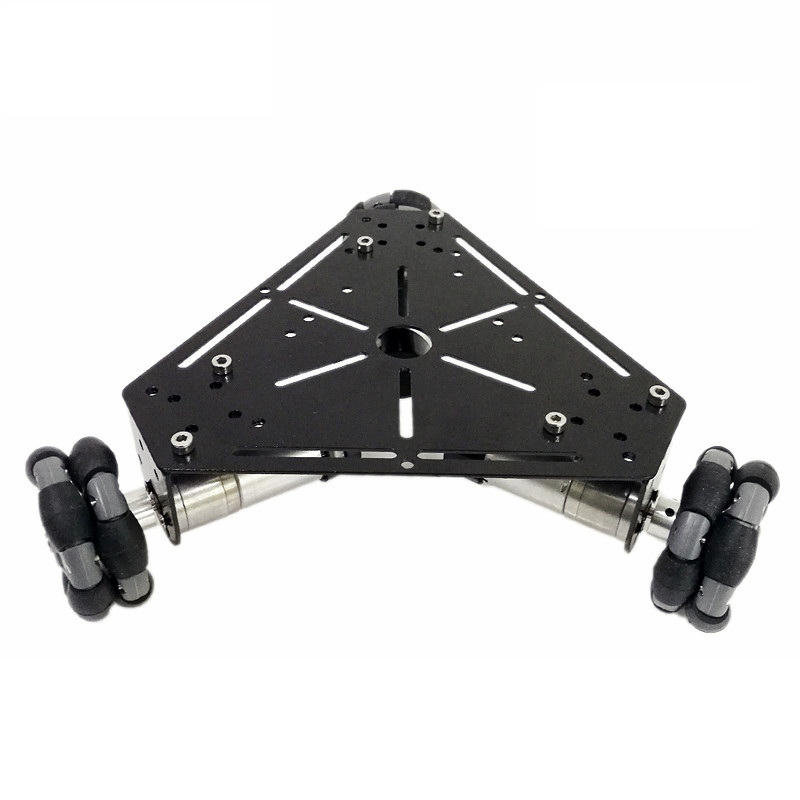
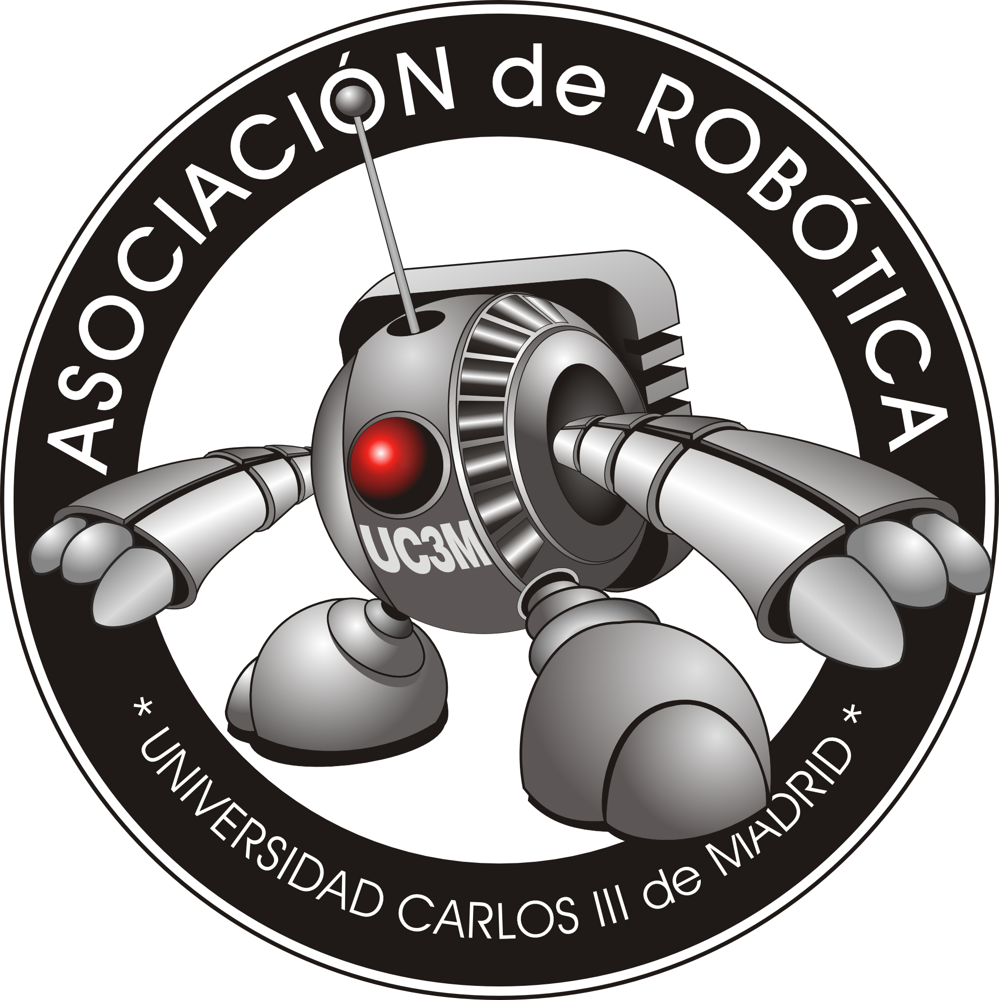

# OmniRobot
Diseño e implementación de un robot omnidireccional para fines de entretenimiento. Proyecto de Final de Grado de Ingeniería Electrónica Industrial y Automática por la Universidad Carlos III de Madrid. 

## BOM (Build Of Materials)

* [Pololu Dual MC33926 Motor Driver Carrier](https://www.pololu.com/product/1213)
* [Omni Wheel 40x28mm Plástico](https://hobbyking.com/es_es/40x28mm-plastic-omni-wheel-2pcs-bag.html)
* Partes Impresas en **PETG** de [Fiberlogy](https://fiberlogy.com/en/fiberlogy-filaments/filament-pet-g/)

## Contributors

 - [Asociación de Robótica de la Universidad Carlos III de Madrid](https://asrob.uc3m.es/)

## License 

This robot is licensed under a [Creative Commons Attribution-ShareAlike 4.0 International License](http://creativecommons.org/licenses/by-sa/4.0/). Please read the LICENSE files for more details.

Este robot tiene una licencia [Creative Commons Attribution-ShareAlike 4.0 International License](http://creativecommons.org/licenses/by-sa/4.0/). Por favor, lea los ficheros LICENSE para más detalles

Original concept by [k120189](http://www.thingiverse.com/k120189/about) on [Thingiverse](http://www.thingiverse.com/thing:43708)

More information: [CC-BY-SA](https://github.com/GioSunrider/OmniRobot/blob/master/LICENSE)

