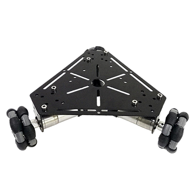

# OmniRobot
Diseño e implementación de un robot omnidireccional para fines de entretenimiento. Proyecto de Final de Grado de Ingeniería Electrónica Industrial y Automática por la Universidad Carlos III de Madrid. 

## BOM (Build Of Materials)

### Three Wheel Robot

* [100:1 Metal Gearmotor 37Dx57L mm](https://www.pololu.com/product/1106/specs)
* [Pololu Dual MC33926 Motor Driver Carrier](https://www.pololu.com/product/1213)
* [Pro Micro - 5V/16MHz](https://www.sparkfun.com/products/12640)
* [Omni Wheel 40x28mm Plástico](https://hobbyking.com/es_es/40x28mm-plastic-omni-wheel-2pcs-bag.html)
* Partes Impresas en **PETG** de [Fiberlogy](https://fiberlogy.com/en/fiberlogy-filaments/filament-pet-g/)
* [Laser Diodo 5V](http://es.aliexpress.com/item/2009851151.html?spm=a2g0o.productlist.0.0.40f26813k8I7Ck&s=p&algo_pvid=c5d8cc0d-3ff0-4b22-85c3-b2305a73ad61&algo_expid=c5d8cc0d-3ff0-4b22-85c3-b2305a73ad61-0&btsid=85ceb6a5-5363-47af-8a4d-39bfda747067&ws_ab_test=searchweb0_0,searchweb201602_1,searchweb201603_55)
* [Convertidor DC-DC 5V](https://es.aliexpress.com/item/33011856834.html?spm=a2g0o.productlist.0.0.31507f5d5wsfP0&algo_pvid=eb5c1ece-d9a8-4c31-ae05-23024964b12d&algo_expid=eb5c1ece-d9a8-4c31-ae05-23024964b12d-43&btsid=8e2bf819-1793-42b9-9423-cb181d235168&ws_ab_test=searchweb0_0,searchweb201602_1,searchweb201603_55)
* [Servo motor 90º](https://es.aliexpress.com/item/32958137557.html?spm=a2g0o.productlist.0.0.38395ffcnHvPYp&algo_pvid=6b33371f-709e-41a7-b57c-b89138e1f862&algo_expid=6b33371f-709e-41a7-b57c-b89138e1f862-20&btsid=8bcbdc6c-d87f-41bc-9f08-9705c3b9d47c&ws_ab_test=searchweb0_0,searchweb201602_1,searchweb201603_55) 

### Four Wheel Robot

* [30:1 Metal Gearmotor 37Dx57L mm](https://www.pololu.com/product/4742)
* [Pololu Dual MC33926 Motor Driver Carrier](https://www.pololu.com/product/1213)
* [Pro Micro - 5V/16MHz](https://www.sparkfun.com/products/12640)
* Partes Impresas en **PETG** de [Fiberlogy](https://fiberlogy.com/en/fiberlogy-filaments/filament-pet-g/)
* [Laser Diodo 5V](http://es.aliexpress.com/item/2009851151.html?spm=a2g0o.productlist.0.0.40f26813k8I7Ck&s=p&algo_pvid=c5d8cc0d-3ff0-4b22-85c3-b2305a73ad61&algo_expid=c5d8cc0d-3ff0-4b22-85c3-b2305a73ad61-0&btsid=85ceb6a5-5363-47af-8a4d-39bfda747067&ws_ab_test=searchweb0_0,searchweb201602_1,searchweb201603_55)
* [Convertidor DC-DC 5V](https://es.aliexpress.com/item/33011856834.html?spm=a2g0o.productlist.0.0.31507f5d5wsfP0&algo_pvid=eb5c1ece-d9a8-4c31-ae05-23024964b12d&algo_expid=eb5c1ece-d9a8-4c31-ae05-23024964b12d-43&btsid=8e2bf819-1793-42b9-9423-cb181d235168&ws_ab_test=searchweb0_0,searchweb201602_1,searchweb201603_55)
* [Servo motor 90º](https://es.aliexpress.com/item/32958137557.html?spm=a2g0o.productlist.0.0.38395ffcnHvPYp&algo_pvid=6b33371f-709e-41a7-b57c-b89138e1f862&algo_expid=6b33371f-709e-41a7-b57c-b89138e1f862-20&btsid=8bcbdc6c-d87f-41bc-9f08-9705c3b9d47c&ws_ab_test=searchweb0_0,searchweb201602_1,searchweb201603_55) 

## Contributors

 - Tutored by [@David-Estevez](https://github.com/David-Estevez)
 - [Asociación de Robótica de la Universidad Carlos III de Madrid](https://asrob.uc3m.es/)

## License 

This robot is licensed under a [Creative Commons Attribution-ShareAlike 4.0 International License](http://creativecommons.org/licenses/by-sa/4.0/). Please read the LICENSE files for more details.

Este robot tiene una licencia [Creative Commons Attribution-ShareAlike 4.0 International License](http://creativecommons.org/licenses/by-sa/4.0/). Por favor, lea los ficheros LICENSE para más detalles

